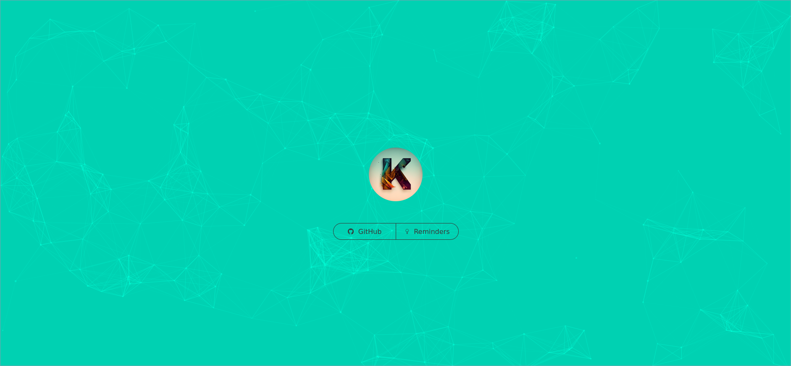
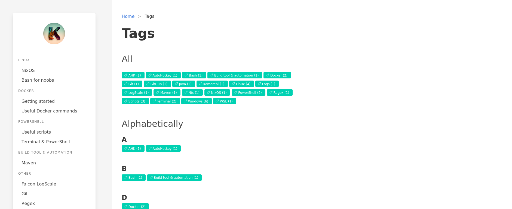
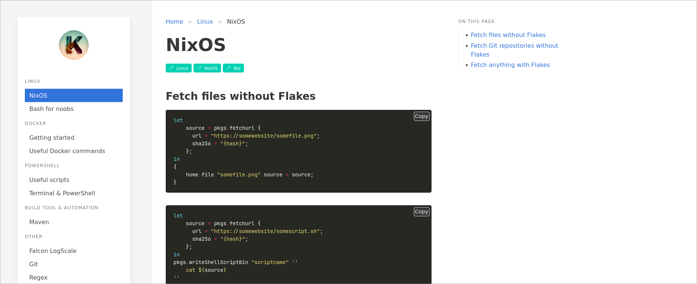

# About this project

Visit https://kimgoetzke.github.io/ to launch this page.

The purpose of this project was to refresh my CSS skills, practice Hugo and Bulma, and create a simple and accessible
way to host a few reminders.

## Demo





## How to develop locally

- Run development server with `hugo server`
- Create a new page with `hugo new folder_name/page_name.md`

#### Using NixOS?

If you have `direnv` installed, `hugo` will be made available in your shell. If not, you can start a nix-shell with:

```nix
nix-shell -p hugo
```